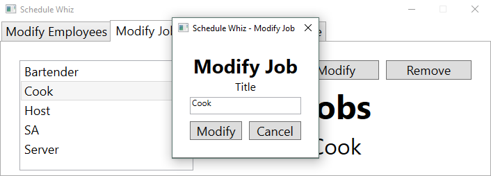
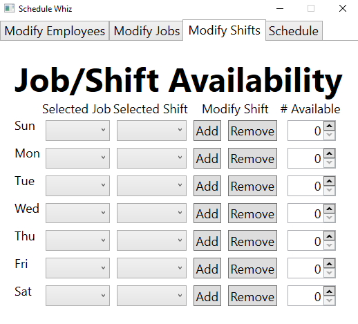

# Schedule Whiz
Schedule Whiz is an app that will allow you to input all of your employees, jobs, shifts, and the number of available shifts for each day into a UI.
It will use this information to quickly output a formatted excel spreadsheet with a schedule that you can present to the employees.

## Modify Employees
Create and update employees with their e-mail address and phone numbers.
Assign or un-assign them job titles.

## Modify Jobs
Create a master list of job titles that can be assigned to your employees.

## Modify Shifts
Create flexible job and shift availablity for each day of the week.

# Generate A Schedule
Quickly generate a schedule in an Excel spreadsheet.

## Built With
C# .Net WPF

## Version
Alpha

## Author
Cory Hanson [CoryHanson.us](https://coryhanson.us)

## License
MIT